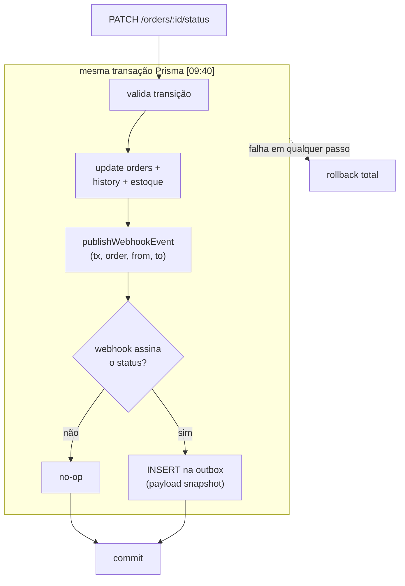
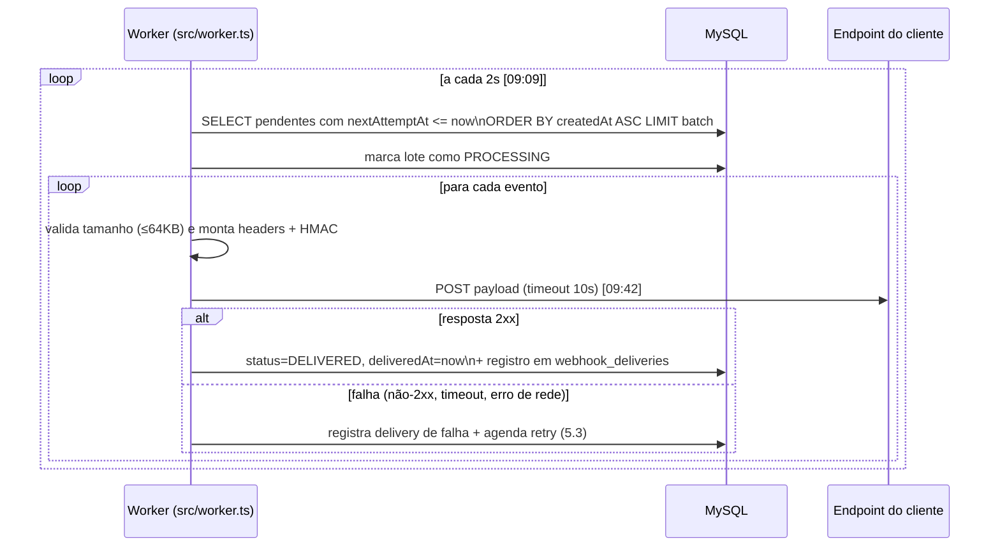

# FDD — Sistema de Webhooks de Notificação de Pedidos

> **Convenção de rastreabilidade:** decisões vindas da reunião carregam `[hh:mm]` da `TRANSCRICAO.md`; referências ao código apontam arquivos reais do repositório. Detalhes de implementação que a reunião não definiu estão marcados como *(definido neste FDD)* — são propostas de design coerentes com as decisões registradas, a serem validadas na revisão.

## 1. Contexto e motivação técnica

O OMS muda o status de pedidos exclusivamente pelo método `changeStatus` de [`src/modules/orders/order.service.ts`](../src/modules/orders/order.service.ts), dentro de uma transação Prisma que valida a transição na máquina de estados ([`src/modules/orders/order.status.ts`](../src/modules/orders/order.status.ts)), atualiza `orders`, grava auditoria em `order_status_history` e debita/repõe estoque. Não existe hoje nenhum mecanismo de eventos, filas ou notificação externa.

Clientes B2B precisam ser notificados dessas mudanças com latência < 10s ([09:02] Marcos). A reunião decidiu a arquitetura (ver [RFC](RFC.md) e [ADRs](adrs/README.md)); este documento especifica **como construir**: outbox transacional no MySQL, worker de entrega em processo separado, retry com backoff + DLQ, assinatura HMAC-SHA256 e semântica at-least-once.

## 2. Objetivos técnicos

1. Garantir por construção: status mudou ⇔ evento registrado (mesma transação; rollback conjunto) ([09:40]–[09:41]).
2. Entregar eventos em ≤ 10s no caminho feliz (polling de 2s + envio HTTP) ([09:02], [09:09]).
3. Tolerar indisponibilidade do cliente por até ~15h (5 tentativas com backoff) antes de mover para DLQ ([09:17]).
4. Permitir ao cliente verificar autenticidade e integridade de cada entrega (HMAC-SHA256, secret por endpoint) ([09:20]–[09:22]).
5. Zero dependência ou infraestrutura nova; reuso integral dos padrões do projeto ([09:30], [ADR-006](adrs/ADR-006-reuso-dos-padroes-existentes-do-projeto.md)).

## 3. Escopo e exclusões

**No escopo:** CRUD de configuração de webhooks; rotação de secret; tabelas `webhook_outbox`, `webhook_dead_letter` e histórico de entregas; worker de entrega (`src/worker.ts`); integração no `changeStatus`; endpoint admin de replay; validações e erros `WEBHOOK_*`.

**Fora do escopo (decidido na reunião):**
- Notificação por email de falhas — próxima fase ([09:37]).
- Rate limiting de saída — observar e decidir depois ([09:39]).
- Dashboard visual — projeto separado do frontend ([09:40]).
- Webhooks inbound ([09:02]).
- Arquivamento de linhas entregues da outbox ([09:08]).
- Múltiplos workers em paralelo ([09:13]).

## 4. Modelo de dados

Quatro modelos novos em [`prisma/schema.prisma`](../prisma/schema.prisma), seguindo os padrões existentes (PK UUID `@db.Char(36)`, `@@map` snake_case, índices explícitos — ver seção 11). Esboço *(nomes de colunas definidos neste FDD; estrutura decidida na reunião)*:

```prisma
enum WebhookOutboxStatus {
  PENDING     // pendente
  PROCESSING  // processando
  FAILED      // falhou (esgotou tentativas — cópia na DLQ)
  DELIVERED   // entregue
}

model WebhookEndpoint {
  id         String   @id @default(uuid()) @db.Char(36)
  customerId String   @db.Char(36)
  url        String   @db.VarChar(2048)   // somente https [09:23]
  events     Json     // lista de OrderStatus assinados [09:33]
  active     Boolean  @default(true)      // url + secret + customer_id + estado ativo [09:21]
  createdAt  DateTime @default(now())
  updatedAt  DateTime @updatedAt

  customer   Customer @relation(fields: [customerId], references: [id])
  secrets    WebhookSecret[]

  @@index([customerId])
  @@map("webhook_endpoints")
}

model WebhookSecret {
  id         String    @id @default(uuid()) @db.Char(36)
  webhookId  String    @db.Char(36)
  secret     String    @db.VarChar(128)
  createdAt  DateTime  @default(now())
  expiresAt  DateTime? // null = vigente; rotação seta +24h na antiga [09:21]

  webhook    WebhookEndpoint @relation(fields: [webhookId], references: [id], onDelete: Cascade)

  @@index([webhookId])
  @@map("webhook_secrets")
}

model WebhookOutbox {
  id            String              @id @default(uuid()) @db.Char(36) // = event_id do X-Event-Id [09:25]
  webhookId     String              @db.Char(36)
  orderId       String              @db.Char(36)
  eventType     String              @db.VarChar(64)     // "order.status_changed" [09:43]
  payload       Json                // snapshot renderizado na inserção [09:52] (ADR-007)
  status        WebhookOutboxStatus @default(PENDING)
  attempts      Int                 @default(0)
  nextAttemptAt DateTime            @default(now())
  lastError     String?             @db.VarChar(500)
  createdAt     DateTime            @default(now())
  deliveredAt   DateTime?

  @@index([status])      // [09:08]
  @@index([createdAt])   // [09:08]
  @@map("webhook_outbox")
}

model WebhookDeadLetter {
  id            String   @id @default(uuid()) @db.Char(36)
  outboxEventId String   @db.Char(36)
  webhookId     String   @db.Char(36)
  payload       Json     // payload, motivo da falha e timestamp [09:18]
  reason        String   @db.VarChar(500)
  failedAt      DateTime @default(now())
  replayedAt    DateTime?
  replayedById  String?  @db.Char(36)

  // FK para User, no mesmo padrão de OrderStatusHistory.changedBy —
  // auditoria de quem executou o replay [09:36]
  replayedBy    User?    @relation("WebhookReplayedBy", fields: [replayedById], references: [id])

  @@index([webhookId])
  @@map("webhook_dead_letter")
}

model WebhookDelivery {
  id             String   @id @default(uuid()) @db.Char(36)
  outboxEventId  String   @db.Char(36)
  webhookId      String   @db.Char(36)
  success        Boolean            // sucesso/falha [09:34]
  httpStatus     Int?
  payload        Json
  responseBody   String?  @db.Text  // response [09:34]
  responseTimeMs Int                // tempo de resposta [09:34]
  attemptedAt    DateTime @default(now())

  @@index([webhookId, attemptedAt])
  @@map("webhook_deliveries")
}
```

Nota: a FK `replayedBy` exige a relação reversa no model `User` existente (`webhookReplays WebhookDeadLetter[] @relation("WebhookReplayedBy")`) — é uma linha no `schema.prisma`, sem coluna nova na tabela `users` (nenhuma mudança física em tabela existente).

## 5. Fluxos detalhados

### 5.1 Criação do evento na outbox (publicação transacional)



1. `changeStatus` chama `publishWebhookEvent(tx, order, fromStatus, toStatus)` — função pura que recebe o `Prisma.TransactionClient` da transação corrente ([09:41] Bruno/Diego); nenhum repository injetado no `OrderService`.
2. O **filtro é aplicado na inserção**: consulta os `WebhookEndpoint` ativos do `customerId` cujo `events` contém `toStatus`; sem assinantes, nada é inserido — economiza linhas ([09:34] Bruno).
3. Para cada assinante, insere uma linha com `payload` **já renderizado** (snapshot do estado do pedido na transição — [ADR-007](adrs/ADR-007-snapshot-do-payload-na-insercao.md)) e `id` UUID, que será o `X-Event-Id` ([09:25]).
4. Falha no insert ⇒ exceção ⇒ rollback da transação inteira: não existe status novo sem evento ([09:40] Bruno).

### 5.2 Processamento pelo worker



- Processo separado da API ([09:11]): entry `src/worker.ts`, script `npm run worker`, mesma `DATABASE_URL`, instância própria de `PrismaClient` ([09:30]).
- Batch pequeno ([09:08]); tamanho configurável via variável de ambiente `WEBHOOK_WORKER_BATCH_SIZE`, default 20 *(definido neste FDD)* — validada no schema fail-fast de [`src/config/env.ts`](../src/config/env.ts), como as demais variáveis do projeto (ADR-006). O default 20 drena o burst citado na reunião (50 mudanças de status em um minuto, [09:38]) em ~6s, dentro do SLA de 10s, sem deixar de ser "pequeno".
- Single-worker: leitura em ordem de `createdAt` dá ordering por `order_id` ([09:12]); sem garantia global (limitação documentada, [09:13]).
- Sucesso = resposta HTTP 2xx *(definido neste FDD; a reunião fixou apenas timeout e retry)*. Qualquer outra coisa (não-2xx, timeout de 10s, erro de conexão) conta como falha.
- Cada tentativa (sucesso ou falha) gera um registro em `webhook_deliveries` com status HTTP, corpo da resposta e tempo em ms — alimenta o `GET /webhooks/:id/deliveries` ([09:34]).
- **Recuperação de crash** *(mecanismo e número definidos neste FDD — a reunião não tratou desse cenário)*: eventos presos em `PROCESSING` por mais de 5 minutos voltam a ser elegíveis no poll. O threshold é derivado dos números fixados na reunião: o pior ciclo legítimo do worker é `batch × timeout` (20 × 10s ≈ 3min20, [09:42]); o valor precisa ficar **acima** disso para não reclassificar como órfão um evento ainda em processamento num ciclo lento — 5min é o primeiro valor redondo com folga. **Regra de acoplamento:** se `WEBHOOK_WORKER_BATCH_SIZE` mudar, o threshold deve respeitar `batch × 10s + margem`. Reclassificação pode gerar entrega duplicada — coberto pela semântica at-least-once ([ADR-005](adrs/ADR-005-entrega-at-least-once-com-x-event-id.md)).

### 5.3 Retry com backoff

| Tentativa | Espera após a falha | Acumulado desde a 1ª falha |
| --- | --- | --- |
| 1ª falha → retry 1 | 1 min | 1 min |
| retry 1 → retry 2 | 5 min | 6 min |
| retry 2 → retry 3 | 30 min | 36 min |
| retry 3 → retry 4 | 2 h | ~2h36 |
| retry 4 → retry 5 | 12 h | **~14h36** ("quase 15 horas" [09:17]) |

- Na falha: `attempts++`, `lastError` preenchido, `nextAttemptAt = now + backoff[attempts]`, status volta a `PENDING`. O agendamento é **persistido** — reinício do worker não perde nem antecipa retries.
- 5 tentativas no total ([09:15]–[09:17]); depois disso, falha permanente → fluxo 5.4.

### 5.4 DLQ e replay

1. Esgotadas as 5 tentativas, o evento é marcado `FAILED` na outbox e uma cópia é inserida em `webhook_dead_letter` com payload, motivo da última falha e timestamp ([09:18] Diego) — tabela separada mantém a leitura da outbox limpa e serve de evidência para debug ([ADR-003](adrs/ADR-003-retry-com-backoff-exponencial-e-dlq.md)).
2. Evento com payload > 64KB **não é enviado**: vai direto para a DLQ com `reason = WEBHOOK_PAYLOAD_TOO_LARGE`, sem consumir retries *(encaminhamento definido neste FDD — retry não resolve tamanho; o limite e o comportamento "erra, não trunca" são da reunião [09:23]–[09:24])*.
3. Replay é **manual**, via `POST /api/v1/admin/webhooks/dead-letter/:id/replay` (contrato na seção 6): reinsere o evento na outbox como `PENDING` com `attempts = 0`, grava `replayedAt`/`replayedById` na DLQ e loga quem executou ([09:18], [09:36]).

### 5.5 Rotação de secret

1. Cliente chama `POST /api/v1/webhooks/:id/rotate-secret`; a plataforma gera nova secret e seta `expiresAt = now + 24h` na antiga ([09:21] Sofia).
2. Durante o grace period, o header `X-Signature` carrega **duas assinaturas separadas por vírgula** (nova primeiro, antiga depois); o cliente valida contra qualquer uma *(mecânica definida neste FDD — a reunião fixou o grace de 24h com as duas secrets válidas em paralelo)*.
3. Após `expiresAt`, a secret antiga é ignorada na assinatura ("depois disso, a antiga morre" [09:21]).

## 6. Contratos públicos

Todos os endpoints sob `/api/v1` (padrão de [`src/app.ts`](../src/app.ts)), autenticados com JWT Bearer (`authenticate`); apenas o replay exige `requireRole('ADMIN')` ([09:36]–[09:37]). Erros seguem o envelope existente `{ "error": { "code", "message", "details?" } }` de [`src/middlewares/error.middleware.ts`](../src/middlewares/error.middleware.ts). O `customerId` vai no body/query — **não** vem do JWT, que é do usuário operador ([09:32] Larissa).

### 6.1 `POST /api/v1/webhooks` — cadastrar webhook

Request ([09:31] Marcos):
```json
{
  "customerId": "5f0e2a4e-93a1-4f3f-a2b7-6e9f1c2d3a4b",
  "url": "https://api.atlascomercial.com.br/hooks/oms",
  "events": ["SHIPPED", "DELIVERED"]
}
```
Response `201 Created` — a secret é gerada pela plataforma e devolvida **somente aqui** ([09:31]):
```json
{
  "id": "b3a1c9d0-7e2f-4a5b-8c6d-1e2f3a4b5c6d",
  "customerId": "5f0e2a4e-93a1-4f3f-a2b7-6e9f1c2d3a4b",
  "url": "https://api.atlascomercial.com.br/hooks/oms",
  "events": ["SHIPPED", "DELIVERED"],
  "active": true,
  "secret": "8f4e2b1a9c7d5e3f0a8b6c4d2e1f9a7b5c3d1e0f8a6b4c2d",
  "createdAt": "2026-08-05T12:00:00.000Z"
}
```
Erros: `400 WEBHOOK_INVALID_URL` (url `http://`), `400 VALIDATION_ERROR` (Zod), `404 NOT_FOUND` (customer inexistente), `401 UNAUTHORIZED`.

### 6.2 `GET /api/v1/webhooks?customerId=...` — listar webhooks do customer

Response `200 OK` ([09:33]) — lista simples, **sem paginação**:
```json
{
  "data": [
    {
      "id": "b3a1c9d0-7e2f-4a5b-8c6d-1e2f3a4b5c6d",
      "customerId": "5f0e2a4e-93a1-4f3f-a2b7-6e9f1c2d3a4b",
      "url": "https://api.atlascomercial.com.br/hooks/oms",
      "events": ["SHIPPED", "DELIVERED"],
      "active": true,
      "createdAt": "2026-08-05T12:00:00.000Z"
    }
  ]
}
```
A secret **nunca** aparece em listagem/consulta. Erros: `400 VALIDATION_ERROR` (query `customerId` ausente ou não-UUID — validação Zod genérica, por isso sem prefixo `WEBHOOK_`), `401 UNAUTHORIZED`.

### 6.3 `PATCH /api/v1/webhooks/:id` — editar webhook

Request ([09:33] — campos opcionais):
```json
{ "url": "https://api-nova.atlascomercial.com.br/hooks/oms", "events": ["PAID", "SHIPPED", "DELIVERED"], "active": false }
```
Response `200 OK`: objeto atualizado (sem secret). Erros: `404 WEBHOOK_NOT_FOUND`, `400 WEBHOOK_INVALID_URL`, `400 VALIDATION_ERROR`.

### 6.4 `DELETE /api/v1/webhooks/:id` — remover webhook

Response `204 No Content` ([09:33]). Erros: `404 WEBHOOK_NOT_FOUND`.

### 6.5 `POST /api/v1/webhooks/:id/rotate-secret` — rotacionar secret

Response `200 OK` ([09:21]):
```json
{
  "secret": "1a2b3c4d5e6f7a8b9c0d1e2f3a4b5c6d7e8f9a0b1c2d3e4f",
  "previousSecretValidUntil": "2026-08-06T12:00:00.000Z"
}
```
Erros: `404 WEBHOOK_NOT_FOUND`.

### 6.6 `GET /api/v1/webhooks/:id/deliveries` — histórico de entregas

Response `200 OK` — últimos 100 envios ([09:34] Marcos):
```json
{
  "data": [
    {
      "eventId": "e7c1d2b3-a4f5-6e7d-8c9b-0a1b2c3d4e5f",
      "success": false,
      "httpStatus": 503,
      "payload": { "event_type": "order.status_changed", "order_number": "ORD-000123" },
      "responseBody": "Service Unavailable",
      "responseTimeMs": 10000,
      "attemptedAt": "2026-08-05T14:03:07.000Z"
    }
  ]
}
```
Erros: `404 WEBHOOK_NOT_FOUND`.

### 6.7 `POST /api/v1/admin/webhooks/dead-letter/:id/replay` — replay de DLQ (ADMIN)

Requer `requireRole('ADMIN')` ([09:36] Sofia); execução logada para auditoria. Response `200 OK` ([09:18] — recoloca na outbox como pendente):
```json
{ "replayed": true, "outboxEventId": "e7c1d2b3-a4f5-6e7d-8c9b-0a1b2c3d4e5f" }
```
Erros: `404 WEBHOOK_DEAD_LETTER_NOT_FOUND`, `403 FORBIDDEN` (role insuficiente), `401 UNAUTHORIZED`.

### 6.8 Contrato de entrega (o request que ENVIAMOS ao cliente)

`POST {url do webhook}` com headers ([09:44] Diego/Sofia):

| Header | Conteúdo |
| --- | --- |
| `Content-Type` | `application/json` |
| `X-Event-Id` | UUID do evento (dedup at-least-once, [09:25]) |
| `X-Signature` | **Assinatura** HMAC-SHA256 (hex) do corpo, calculada com a secret como chave — a secret em si nunca é enviada ([09:20]: "manda a assinatura"). Durante o grace de rotação, duas assinaturas separadas por vírgula (5.5) |
| `X-Timestamp` | timestamp **do envio desta tentativa** — difere do `timestamp` do payload, que é o momento da transição de status e não muda entre retries. Permite ao cliente detectar replay attack ([09:44]) |
| `X-Webhook-Id` | id do endpoint webhook (cliente com vários cadastros, [09:44] Sofia) |

Body ([09:43] Diego — payload enxuto, sem items; detalhes via `GET /orders/:id`):
```json
{
  "event_id": "e7c1d2b3-a4f5-6e7d-8c9b-0a1b2c3d4e5f",
  "event_type": "order.status_changed",
  "timestamp": "2026-08-05T14:02:55.000Z",
  "order_id": "0d9c8b7a-6f5e-4d3c-2b1a-0f9e8d7c6b5a",
  "order_number": "ORD-000123",
  "from_status": "PROCESSING",
  "to_status": "SHIPPED",
  "customer_id": "5f0e2a4e-93a1-4f3f-a2b7-6e9f1c2d3a4b",
  "total_cents": 15990
}
```
Verificação do lado do cliente ([09:20]: "Cliente verifica do lado dele") — recalcular o HMAC do corpo recebido com a secret compartilhada e comparar com o header:

```js
const expected = crypto.createHmac('sha256', secret).update(rawBody).digest('hex');
const valid = request.headers['x-signature']
  .split(',')
  .some((sig) => crypto.timingSafeEqual(Buffer.from(sig), Buffer.from(expected)));
```

Semântica: resposta 2xx em até 10s = entregue; qualquer outra coisa = falha (retry, seção 5.3). Entrega **at-least-once**: o cliente deve deduplicar por `X-Event-Id` ([09:24]–[09:26]). O `event_id` aparece no header (dedup sem parse do corpo) e no payload (evento autocontido e coberto pela assinatura) — ambos definidos na reunião ([09:43], [09:44]).

## 7. Matriz de erros (`WEBHOOK_*`)

Códigos seguem o padrão do projeto ([`src/shared/errors/http-errors.ts`](../src/shared/errors/http-errors.ts)); os três primeiros foram citados nominalmente na reunião ([09:28] Bruno), os demais derivam de requisitos registrados. "Worker" = erro interno de entrega (gravado em `lastError`/`reason`, não é resposta HTTP da nossa API).

| Código | HTTP | Camada | Quando ocorre | Origem |
| --- | --- | --- | --- | --- |
| `WEBHOOK_NOT_FOUND` | 404 | API | id de webhook inexistente | [09:28] |
| `WEBHOOK_INVALID_URL` | 400 | API | URL não-HTTPS ou malformada no cadastro/edição | [09:28] + [09:23] |
| `WEBHOOK_INVALID_EVENT_STATUS` | 400 | API | `events` contém valor fora do enum `OrderStatus` | derivado de [09:33] + enum em [`prisma/schema.prisma`](../prisma/schema.prisma) |
| `WEBHOOK_DEAD_LETTER_NOT_FOUND` | 404 | API | replay de id inexistente na DLQ | derivado de [09:18] |
| `WEBHOOK_PAYLOAD_TOO_LARGE` | — | Worker | payload > 64KB: não envia, vai direto à DLQ | [09:23]–[09:24] |
| `WEBHOOK_DELIVERY_TIMEOUT` | — | Worker | cliente não respondeu em 10s; conta como falha para retry | [09:42] |
| `WEBHOOK_DELIVERY_FAILED` | — | Worker | resposta não-2xx do cliente | derivado de [09:14]–[09:15] |

Erros genéricos existentes (`VALIDATION_ERROR`, `UNAUTHORIZED`, `FORBIDDEN`, `NOT_FOUND`) continuam vindo do middleware central sem mudança ([09:29]).

> Nota de rastreabilidade: a reunião citou também `WEBHOOK_SECRET_REQUIRED` como exemplo do padrão de nomenclatura ([09:28] Bruno). Ele **não** entrou nesta matriz porque o design não tem gatilho real para ele: todo webhook nasce com secret gerada pela plataforma ([09:31]) e a rotação nunca deixa o endpoint sem secret vigente (fluxo 5.5) — "webhook sem secret" é estado impossível por construção. Se a implementação quiser uma guarda defensiva para esse invariante, deve ser erro interno (500), não contrato público.

## 8. Estratégias de resiliência

| Mecanismo | Especificação | Origem |
| --- | --- | --- |
| Timeout de entrega | 10s por chamada HTTP (`AbortSignal.timeout(10_000)` com fetch nativo do Node ≥ 20) | [09:42] |
| Retry | Backoff exponencial 1m/5m/30m/2h/12h, 5 tentativas, agendamento persistido em `nextAttemptAt` | [09:15]–[09:17] |
| Fallback de falha permanente | DLQ em tabela separada + replay manual auditado | [09:18], [09:36] |
| Consistência | Outbox na mesma transação do `changeStatus`; rollback conjunto | [09:40]–[09:41] |
| Duplicatas | At-least-once assumido; dedup no cliente via `X-Event-Id`; recuperação de `PROCESSING` órfão após crash | [09:24]–[09:26] |
| Isolamento de processos | Worker separado: reinício da API não afeta entregas, e vice-versa; graceful shutdown no padrão de [`src/server.ts`](../src/server.ts) (SIGINT/SIGTERM + `prisma.$disconnect`) | [09:11] |
| Proteção da outbox | Índices em `status` e `createdAt`; leitura em batch pequeno | [09:08] |

Sem circuit breaker e sem rate limiting nesta fase — rate limiting ficou explicitamente como ponto em aberto ([09:39]).

## 9. Observabilidade

Coerente com a restrição de infraestrutura zero ([09:30]): sem Prometheus/OpenTelemetry nesta fase — o projeto hoje só tem Pino (ver [`docs/mapping.md`](mapping.md), seção Observabilidade).

- **Logs** — logger Pino existente ([`src/shared/logger/index.ts`](../src/shared/logger/index.ts)) reutilizado no worker ([09:29]). Eventos logados *(definidos neste FDD)*: `webhook_event_enqueued`, `webhook_delivered` (com `responseTimeMs`), `webhook_delivery_failed` (com tentativa e motivo), `webhook_moved_to_dlq`, `webhook_replayed` (com `userId` — auditoria exigida em [09:36]). **A secret nunca é logada** — incluir `*.secret` nos `redactPaths` do logger.
- **Métricas** — extraídas por SQL das próprias tabelas, sem stack nova *(definido neste FDD)*: eventos `PENDING` (backlog), idade do pendente mais antigo (proxy da latência de entrega vs. SLA de 10s), tamanho da DLQ, taxa de sucesso/falha e p95 de `responseTimeMs` via `webhook_deliveries`.
- **Tracing/correlação** — o `event_id` é o correlation id ponta a ponta: aparece na outbox (PK), em todo log do worker, no header `X-Event-Id` recebido pelo cliente, no histórico de deliveries e na DLQ. Na API, o `X-Request-Id` existente ([`src/middlewares/request-logger.middleware.ts`](../src/middlewares/request-logger.middleware.ts)) cobre as rotas de configuração.

## 10. Dependências e compatibilidade

- **Zero dependências npm novas:** HMAC via `node:crypto`; HTTP de saída via `fetch` nativo (Node ≥ 20, conforme `engines` do [`package.json`](../package.json)); UUIDs via Prisma/`uuid` já presentes.
- **Migration aditiva:** 5 tabelas + 1 enum novos; nenhuma tabela existente é alterada fisicamente (o model `User` ganha apenas a relação reversa de `WebhookDeadLetter.replayedBy`, sem coluna nova). Compatível com rollback de deploy (a API antiga ignora as tabelas novas).
- **Novo script** `"worker"` no `package.json` (`tsx watch` em dev, `node dist/worker.js` em produção — mesmo padrão dos scripts atuais).
- **Nova variável de ambiente** `WEBHOOK_WORKER_BATCH_SIZE` (opcional, default 20) no schema de `src/config/env.ts` e no `.env.example` — default embutido, portanto sem impacto em ambientes existentes.
- **Nenhum endpoint existente muda.** Único arquivo de código existente alterado: `order.service.ts` (seção 11.1). O contrato de `PATCH /orders/:id/status` permanece idêntico para os operadores.
- **Ordem de deploy:** migration → API → worker *(definido neste FDD)*.

## 11. Integração com o sistema existente

### 11.1 [`src/modules/orders/order.service.ts`](../src/modules/orders/order.service.ts) — o ponto de integração crítico
O método `changeStatus` (linhas 126–179) hoje faz, dentro de `this.prisma.$transaction`: validação da transição, `tx.order.update`, `tx.orderStatusHistory.create` e débito/reposição de estoque. A extensão adiciona **uma chamada** após a gravação do histórico: `await publishWebhookEvent(tx, order, from, to)` — função exportada pelo módulo de webhooks que recebe o `Prisma.TransactionClient` (`TxClient`, já tipado no arquivo) ([09:41]). Falha na inserção → exceção → rollback total ([09:40]).

### 11.2 [`src/modules/orders/order.status.ts`](../src/modules/orders/order.status.ts) — máquina de estados como fonte dos eventos
Os valores válidos do filtro `events` são exatamente os `OrderStatus` do enum; toda transição aceita por `canTransition` gera um evento potencial. O schema Zod do módulo valida `events` contra esse enum (erro `WEBHOOK_INVALID_EVENT_STATUS`).

### 11.3 [`src/shared/errors/http-errors.ts`](../src/shared/errors/http-errors.ts) e [`app-error.ts`](../src/shared/errors/app-error.ts) — hierarquia de erros
Novas classes no mesmo molde de `InvalidStatusTransitionError`/`InsufficientStockError` ([09:28]): `WebhookNotFoundError extends NotFoundError`-like (404, `WEBHOOK_NOT_FOUND`), `WebhookInvalidUrlError extends BadRequestError` (400, `WEBHOOK_INVALID_URL`), etc., todas com códigos prefixados `WEBHOOK_` ([09:29]).

### 11.4 [`src/middlewares/error.middleware.ts`](../src/middlewares/error.middleware.ts) — zero mudança
Por herdarem de `AppError`, os novos erros já são traduzidos para `{ error: { code, message, details } }` com o status correto ([09:29] Bruno: "vai pegar nossos erros sem precisar mudar nada").

### 11.5 [`src/middlewares/auth.middleware.ts`](../src/middlewares/auth.middleware.ts) — autenticação e autorização
`authenticate` aplicado no router do módulo (mesmo padrão dos módulos existentes); `requireRole('ADMIN')` — hoje usado só em users — protege o replay ([09:36] Larissa).

### 11.6 [`src/shared/logger/index.ts`](../src/shared/logger/index.ts) — logging
Worker usa `createLogger()` existente ([09:29]); acrescentar `*.secret` aos `redactPaths`.

### 11.7 [`src/server.ts`](../src/server.ts) → novo `src/worker.ts`
A nova entry-point replica o padrão de bootstrap e graceful shutdown de `server.ts` (handlers SIGINT/SIGTERM, `prisma.$disconnect`), trocando `app.listen` pelo loop de polling ([09:11] Larissa). PrismaClient próprio, instanciado via `createPrismaClient()` de [`src/config/database.ts`](../src/config/database.ts) ([09:30]).

### 11.8 [`src/routes/index.ts`](../src/routes/index.ts) e [`src/app.ts`](../src/app.ts) — registro do módulo
Novo `buildWebhookRouter` agregado em `buildApiRouter` sob `/webhooks` (e a rota admin sob `/admin/webhooks`), com o controller adicionado ao tipo `Controllers` e instanciado em `buildControllers` — o mesmo fluxo de DI manual dos 5 módulos atuais.

### 11.9 [`prisma/schema.prisma`](../prisma/schema.prisma) — modelos novos
Seção 4; UUIDs `@db.Char(36)` como todo o schema ([09:51] Larissa: "UUID, segue o padrão do resto do projeto").

### 11.10 [`src/middlewares/validate.middleware.ts`](../src/middlewares/validate.middleware.ts) — validação
Schemas Zod do módulo (`webhook.schemas.ts`) aplicados via `validate()`, incluindo a recusa de URL `http://` ([09:23] Sofia: "é só uma validação no schema Zod").

## 12. Critérios de aceite técnicos

- Transação: forçar falha na inserção da outbox durante `changeStatus` → status do pedido **não** muda (rollback conjunto) ([09:40]).
- Transação: `changeStatus` com sucesso e webhook assinante → exatamente 1 linha `PENDING` na outbox por webhook assinante, com payload snapshot.
- Filtro: mudança para status que nenhum webhook do customer assina → nenhuma linha inserida ([09:34]).
- Latência: evento entregue em ≤ 10s com cliente saudável (polling 2s) ([09:02], [09:09]).
- Assinatura: HMAC-SHA256 do corpo com a secret do endpoint confere com `X-Signature`; headers `X-Event-Id`, `X-Timestamp`, `X-Webhook-Id` presentes ([09:44]).
- Retry: falha do cliente → `nextAttemptAt` seguindo 1m/5m/30m/2h/12h; 6ª falha não existe — evento vai à DLQ após a 5ª ([09:17]).
- DLQ: registro com payload, motivo e timestamp; replay recoloca como `PENDING` com `attempts = 0` ([09:18]).
- Replay: sem role ADMIN → `403 FORBIDDEN`; com ADMIN → sucesso + log de auditoria com o userId ([09:36]).
- Rotação: nova secret devolvida; antiga válida por 24h; após o grace, apenas a nova assina ([09:21]).
- Validações: cadastro com URL `http://` → `400 WEBHOOK_INVALID_URL` ([09:23]); payload > 64KB → DLQ direto, sem envio ([09:24]).
- Ordering: N transições do mesmo pedido entregues na ordem das transições (single-worker) ([09:12]).
- Deliveries: `GET /webhooks/:id/deliveries` retorna os últimos 100 com sucesso/falha, payload, response e tempo ([09:34]).

## 13. Riscos e mitigação

| Risco | Prob. | Impacto | Mitigação |
| --- | --- | --- | --- |
| Insert da outbox alonga a transação de `changeStatus` (que já é pesada, [09:04]) | Média | Baixo | Payload enxuto sem items ([09:43]); um único insert por webhook assinante; filtro na inserção evita linhas inúteis ([09:34]) |
| Worker parado sem ninguém perceber → eventos acumulam e SLA de 10s estoura | Média | Alto | Métrica "idade do pendente mais antigo" (seção 9); processo separado reinicia sem perder nada — estado todo no MySQL |
| Entrega duplicada (crash entre envio e marcação) | Baixa | Médio | By design: at-least-once + dedup por `X-Event-Id` no cliente, documentado no portal ([09:26]) |
| Secret armazenada em claro no banco (necessária para assinar) | Baixa | Alto | Acesso restrito à tabela; secret nunca logada (redact); revisão de segurança dedicada da Sofia antes do deploy ([09:46]) |
| Crescimento de `webhook_outbox`/`webhook_deliveries` degrada polling | Média | Médio | Índices em `status`/`createdAt` + batch pequeno ([09:08]); retenção/arquivamento é questão em aberto assumida ([RFC](RFC.md)) |
| DLQ acumula sem tratamento (replay é manual, sem alerta de email nesta fase [09:37]) | Média | Médio | Métrica de tamanho da DLQ + log `webhook_moved_to_dlq`; alerta automático avaliado em fase futura |
