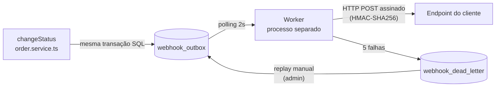

# RFC — Sistema de Webhooks de Notificação de Pedidos

## Metadados

| Campo | Valor |
| --- | --- |
| **Autora** | Larissa (Tech Lead) |
| **Status** | Em revisão |
| **Data** | 2026-08-05 |
| **Revisores** | Marcos (PM), Bruno (Eng. Pleno, Pedidos), Diego (Eng. Sênior, Plataforma), Sofia (Eng. Segurança) |
| **Fontes** | `TRANSCRICAO.md` (reunião técnica, ~55 min) e código do OMS |

## Resumo executivo (TL;DR)

Propomos notificar clientes B2B sobre mudanças de status de pedidos via **webhooks outbound**, usando o **padrão Outbox sobre o MySQL existente**: o evento é gravado na tabela `webhook_outbox` dentro da mesma transação que muda o status do pedido, e um **worker em processo separado** (polling de 2s) entrega os eventos por HTTP com **retry exponencial (5 tentativas) e DLQ**. As entregas são assinadas com **HMAC-SHA256 (secret por endpoint, rotacionável)** e seguem semântica **at-least-once** com dedup pelo cliente via `X-Event-Id`. Nenhuma infraestrutura nova; reuso integral dos padrões do projeto. Estimativa: **3 sprints**, incluindo revisão de segurança.

## Contexto e problema

Três clientes B2B (Atlas Comercial, MaxDistribuição e Nova Cargo) pediram formalmente notificação em tempo real — para eles, latência abaixo de 10 segundos — quando o status dos seus pedidos muda. Hoje eles fazem polling no `GET /orders`, o que torna a integração lenta e cara; a Atlas sinalizou que pode migrar para o concorrente se não houver solução até o fim do trimestre.

O OMS não possui nenhum mecanismo de eventos, filas ou notificação externa. A mudança de status acontece no método `changeStatus` de `src/modules/orders/order.service.ts`, numa transação que já atualiza o pedido, grava auditoria em `order_status_history` e ajusta estoque. Qualquer solução precisa garantir: **se o status mudou, o evento existe; se houve rollback, o evento não existe**.

O escopo é somente **outbound** (plataforma → cliente); webhooks inbound não entram ([09:02]).

## Proposta técnica

Visão geral do fluxo (o detalhamento de contratos, erros e fluxos está no FDD):

1. **Publicação transacional (Outbox)** — na transação de `changeStatus`, uma função `publishWebhookEvent(tx, order, fromStatus, toStatus)` insere o evento na `webhook_outbox`, com o payload já renderizado (snapshot do estado no momento da transição). O filtro por status assinados é aplicado na inserção: se nenhum webhook do customer escuta aquele status, nada é inserido. Ver [ADR-001](adrs/ADR-001-padrao-outbox-no-mysql.md) e [ADR-007](adrs/ADR-007-snapshot-do-payload-na-insercao.md).

2. **Entrega assíncrona (Worker)** — processo Node separado (`src/worker.ts`, `npm run worker`), mesma stack e banco, instância própria de PrismaClient. Polling a cada 2s dos eventos pendentes mais antigos, em batches pequenos. Single-worker nesta fase: ordering garantida por `order_id`, sem garantia global (limitação documentada e aceita). Ver [ADR-002](adrs/ADR-002-worker-em-processo-separado-com-polling.md).

3. **Resiliência (Retry + DLQ)** — timeout de 10s por chamada; falhas fazem retry com backoff exponencial 1m/5m/30m/2h/12h (5 tentativas, ~15h de janela). Falha permanente vai para a tabela `webhook_dead_letter`, com replay manual via endpoint admin (role `ADMIN`, auditado). Ver [ADR-003](adrs/ADR-003-retry-com-backoff-exponencial-e-dlq.md).

4. **Segurança** — corpo assinado com HMAC-SHA256 (`X-Signature`), secret única por endpoint, gerada pela plataforma e rotacionável via API com grace period de 24h. URLs exclusivamente HTTPS. Payload limitado a 64KB (erro acima disso). Ver [ADR-004](adrs/ADR-004-autenticacao-hmac-sha256-com-secret-por-endpoint.md).

5. **Semântica de entrega** — at-least-once, com `X-Event-Id` (UUID por evento) para dedup no lado do cliente, documentada no portal do desenvolvedor. Ver [ADR-005](adrs/ADR-005-entrega-at-least-once-com-x-event-id.md).

6. **API de configuração** — CRUD autenticado de webhooks por customer (criação com secret devolvida, edição, remoção, listagem, filtro de status por endpoint) e consulta de histórico de entregas. Novo módulo `src/modules/webhooks/` seguindo o padrão controller/service/repository/routes/schemas do projeto, erros com prefixo `WEBHOOK_`, logger e error middleware existentes. Ver [ADR-006](adrs/ADR-006-reuso-dos-padroes-existentes-do-projeto.md).

## Alternativas consideradas

| Alternativa | Trade-off que levou ao descarte |
| --- | --- |
| **Disparo síncrono no service de orders** ([09:03]–[09:06]) | Colocaria um HTTP call dentro da transação de `changeStatus`, que já é pesada; cliente lento travaria mudanças de status de outros pedidos, e cliente fora do ar não pode causar rollback de status. "Fora de questão" ([09:06] Diego). |
| **Fila externa (Redis Streams ou similar)** ([09:07]) | Exigiria subir e operar infraestrutura nova; para um time pequeno é overengineering quando o outbox no MySQL existente resolve ([09:07] Diego). |
| **Trigger no banco para acionar o worker** ([09:09]) | Trigger do MySQL só executa SQL — não notifica processo externo (não há NOTIFY/LISTEN como no Postgres); improvisar a notificação "fica esquisito", e polling de 2s já atende o requisito de <10s. |

Alternativas de escopo menor (3 tentativas de retry, retry indefinido, DLQ na própria outbox, secret global, exactly-once, payload renderizado no envio) estão registradas nos ADRs correspondentes.

## Questões em aberto

1. **Rate limiting de saída** — um cliente com 50 pedidos mudando de status em um minuto receberia 50 chamadas. Decisão adiada: observar em produção e decidir depois.
2. **Escala do worker** — como escalar para múltiplos workers sem perder ordering por `order_id` (particionamento ou lock pessimista). Problema do futuro.
3. **Retenção/arquivamento da outbox** — linhas entregues devem ser arquivadas após ~30 dias para evitar uma tabela gigante; fora do escopo desta feature.
4. **Endurecimento de permissões do CRUD** — hoje qualquer role autenticada configura webhooks; pode ser restringido no futuro.

Itens explicitamente rejeitados agora, mas foram abordados e podem ser implementados no futuro: notificação por email de falhas e dashboard visual para o cliente em vez apenas de fornecer a API.

## Impacto e riscos

**Impacto no sistema existente:**
- `order.service.ts#changeStatus` passa a chamar `publishWebhookEvent(tx, ...)` dentro da transação — única alteração em código existente.
- Novas tabelas MySQL (configuração de webhooks, `webhook_outbox`, `webhook_dead_letter`, histórico de entregas), todas com UUID, via migration Prisma.
- Novo processo de execução (worker) para operar e monitorar — hoje o projeto tem um único processo e o `GET /health` não verifica dependências.
- Nenhuma dependência ou infraestrutura nova.

**Riscos principais:**

| Risco | Mitigação |
| --- | --- |
| Cliente sem dedup processa evento duplicado (at-least-once) | `X-Event-Id` + documentação destacada no portal do desenvolvedor |
| DLQ acumula sem ninguém observar (replay é manual e não há alerta por email nesta fase) | Logs estruturados do worker; alertas/email avaliados em fase futura |
| Crescimento contínuo da `webhook_outbox` degrada o polling | Índices em status e `created_at`, leitura em batch pequeno; arquivamento tratado como questão em aberto |
| Vazamento de secret de cliente (já ocorreu no passado) | Secret por endpoint (raio de dano limitado) + rotação com grace de 24h |
| Janela apertada: entrega até fim de novembro | Estimativa de 3 sprints com folga para a revisão de segurança de 2 dias úteis da Sofia |

## Decisões relacionadas

- [ADR-001 — Padrão Outbox no MySQL](adrs/ADR-001-padrao-outbox-no-mysql.md)
- [ADR-002 — Worker em processo separado com polling](adrs/ADR-002-worker-em-processo-separado-com-polling.md)
- [ADR-003 — Retry com backoff exponencial e DLQ](adrs/ADR-003-retry-com-backoff-exponencial-e-dlq.md)
- [ADR-004 — HMAC-SHA256 com secret por endpoint](adrs/ADR-004-autenticacao-hmac-sha256-com-secret-por-endpoint.md)
- [ADR-005 — Entrega at-least-once com X-Event-Id](adrs/ADR-005-entrega-at-least-once-com-x-event-id.md)
- [ADR-006 — Reuso dos padrões existentes do projeto](adrs/ADR-006-reuso-dos-padroes-existentes-do-projeto.md)
- [ADR-007 — Snapshot do payload na inserção](adrs/ADR-007-snapshot-do-payload-na-insercao.md)
